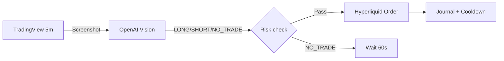

<div align="center">

# ⚡ Arvor

### Hyperliquid ETH Bot · Nested Fractal · AI Vision

**Screenshots your TradingView chart → AI reads your signal → trades ETH on Hyperliquid**

<br/>

[](https://www.python.org/)
[](https://hyperliquid.xyz/)
[](https://openai.com/)
[](https://railway.app/)

<br/>

**Repos (same code, both stay in sync):**  
[shep95/arvor-automated-trading-bot](https://github.com/shep95/arvor-automated-trading-bot) · [ZorakCorp/arvor-automated-trading-bot](https://github.com/ZorakCorp/arvor-automated-trading-bot)

<br/>

[Setup Checklist](#-setup-checklist-zero-to-running) · [Railway Variables](#-railway-variables-copy-paste) · [How to Know It Works](#-how-to-know-its-working) · [Troubleshooting](#-troubleshooting)

</div>

---

## 📋 What you need before you start

Gather these **before** opening Railway:

| # | What | Where to get it |
|---|------|-----------------|
| 1 | **OpenAI API key** | [platform.openai.com/api-keys](https://platform.openai.com/api-keys) |
| 2 | **TradingView chart URL** | Your saved ETH 5m chart with Nested Fractal (see Part 1 below) |
| 3 | **Hyperliquid account + USDC** | [app.hyperliquid.xyz](https://app.hyperliquid.xyz) (live trading only) |
| 4 | **Wallet private key** | MetaMask → account with your Hyperliquid funds (live only) |
| 5 | **GitHub account** | To connect Railway to this repo |
| 6 | **Railway account** | [railway.app](https://railway.app) |

> **Paper mode first?** You only need items **1** and **2**. No Hyperliquid keys required.

---

## 🚀 Setup checklist (zero to running)

### Part 1 — TradingView chart (15 min)

**Goal:** A link the bot can screenshot every minute.

1. Go to [tradingview.com](https://www.tradingview.com) and log in.
2. Open **ETH** (e.g. `BINANCE:ETHUSDT` or Hyperliquid ETH).
3. Set timeframe to **5m** (bottom toolbar).
4. Click **Indicators** → add your Pine script **Nested Fractal - Clean**.
5. Zoom the chart so the **right side** shows:
   - Gold **TP:** line (when signal active)
   - Orange **SL:** line
   - **LONG** or **SHORT** panel
6. Click **Save** (top toolbar) → save the layout.
7. Copy the **full URL** from your browser bar.  
   Example: `https://www.tradingview.com/chart/AbCdEf123/MyLayout/`
8. Keep this URL — you'll paste it as `TRADINGVIEW_CHART_URL`.

> **Tip:** Use a layout that loads without login if possible. Railway runs headless — login-only charts may fail.

---

### Part 2 — OpenAI API key (5 min)

1. Go to [platform.openai.com/api-keys](https://platform.openai.com/api-keys).
2. Click **Create new secret key**.
3. Copy the key (starts with `sk-`).
4. Add billing/credits on OpenAI if needed (vision calls cost money).
5. Keep this key — you'll paste it as `OPENAI_API_KEY`.

---

### Part 3 — Hyperliquid wallet (live trading only)

**Skip this entire part if you're testing in paper mode.**

#### Step 3a — Deposit USDC

1. Go to [app.hyperliquid.xyz](https://app.hyperliquid.xyz).
2. Connect **MetaMask** (or your wallet).
3. Click **Deposit** → send **USDC** from Arbitrum to Hyperliquid.
4. Wait until balance shows in the app.

#### Step 3b — Unified account (most users)

New Hyperliquid accounts use a **Unified Account** — Spot and Perps share **one balance**.  
You do **not** need to transfer Spot → Perps manually. The bot handles this automatically.

#### Step 3c — Copy your wallet address

1. In Hyperliquid, click your wallet address (top of page).
2. Copy the full address, e.g. `0x24ff8C760c6433A7507a4C5352e81fCa28806762`.
3. This goes in Railway as `HYPERLIQUID_WALLET_ADDRESS`.

#### Step 3d — Get your private key (same wallet!)

> **There is no separate "Hyperliquid key" or "USDC key".** One Ethereum wallet = one private key.

1. Open **MetaMask**.
2. Click the **account dropdown** (account name at top).
3. Click each account → copy its address until it **matches** the Hyperliquid address from Step 3c.
4. On **that account**: ⋮ → **Account details** → **Show private key** → enter password.
5. Copy the key (starts with `0x`, 64 hex characters).
6. This goes in Railway as `HYPERLIQUID_PRIVATE_KEY`.

> **Critical:** `HYPERLIQUID_PRIVATE_KEY` and `HYPERLIQUID_WALLET_ADDRESS` must be the **same account** — the one with your USDC on Hyperliquid.

---

### Part 4 — Deploy on Railway (20 min)

#### Step 4a — Create project

1. Go to [railway.app](https://railway.app) → log in.
2. Click **New Project**.
3. Choose **Deploy from GitHub repo**.
4. Select **`arvor-automated-trading-bot`** (from shep95 or ZorakCorp).
5. Wait for the first deploy to start.

#### Step 4b — Use Docker (required for screenshots)

1. Click your **service** (the box in the project).
2. Go to **Settings**.
3. Find **Build** section.
4. Set **Builder** → **Dockerfile**.
5. **Dockerfile path** → `Dockerfile` (repo root).
6. Leave **Start command** empty (Dockerfile already runs `python main.py`).

#### Step 4c — Add a volume (keeps your journal)

1. Still in the service → **Volumes** tab.
2. Click **Add Volume**.
3. **Mount path:** `/app/data`
4. Save.

Without this, trade history resets every redeploy.

#### Step 4d — Add variables

1. Click **Variables** tab.
2. Click **Raw Editor** (easiest) or add one-by-one.
3. Paste the block for your mode (see [Railway Variables](#-railway-variables-copy-paste) below).
4. Replace placeholder values with your real keys.
5. Click **Save** → Railway redeploys automatically.

#### Step 4e — Check logs

1. Go to **Deployments** → latest deploy → **View Logs**.
2. Wait 1–2 minutes.
3. Compare to [How to Know It's Working](#-how-to-know-its-working) below.

---

## 🔐 Railway variables (copy-paste)

Open Railway → your service → **Variables** → **Raw Editor**.

---

### Option A — Paper mode (fake money, safe testing)

Copy this, replace the two `YOUR_...` values, save:

```env
# === REQUIRED ===
OPENAI_API_KEY=YOUR_OPENAI_KEY_sk-proj-...
TRADINGVIEW_CHART_URL=https://www.tradingview.com/chart/YOUR_CHART_ID/

# === MODE ===
LIVE_TRADING=false

# === OPTIONAL (defaults are fine) ===
OPENAI_MODEL=gpt-4o
SCREENSHOT_WAIT_MS=22000
PAPER_STARTING_BALANCE=10000
LOG_LEVEL=INFO
```

**Do NOT add** `HYPERLIQUID_PRIVATE_KEY` or `HYPERLIQUID_WALLET_ADDRESS` in paper mode.

---

### Option B — Live trading (real money)

Copy this, replace **every** `YOUR_...` value, save:

```env
# === LIVE TRADING (real funds) ===
LIVE_TRADING=true
ARVOR_CONFIRM_LIVE_RISK=true

# === REQUIRED ===
OPENAI_API_KEY=YOUR_OPENAI_KEY_sk-proj-...
TRADINGVIEW_CHART_URL=https://www.tradingview.com/chart/YOUR_CHART_ID/

# === HYPERLIQUID (same wallet — see Part 3) ===
HYPERLIQUID_WALLET_ADDRESS=0xYOUR_WALLET_ADDRESS_40_CHARS
HYPERLIQUID_PRIVATE_KEY=0xYOUR_PRIVATE_KEY_64_HEX_CHARS

# === HYPERLIQUID OPTIONS ===
HYPERLIQUID_TESTNET=false
AUTO_SPOT_TO_PERP=true

# === OPTIONAL ===
OPENAI_MODEL=gpt-4o
SCREENSHOT_WAIT_MS=22000
LOG_LEVEL=INFO
```

---

### Variable reference (every key explained)

| Variable | Paper | Live | What to put |
|----------|:-----:|:----:|-------------|
| `OPENAI_API_KEY` | ✅ | ✅ | Your OpenAI key (`sk-...`, 20+ chars) |
| `TRADINGVIEW_CHART_URL` | ✅ | ✅ | Full `https://www.tradingview.com/chart/...` link |
| `LIVE_TRADING` | ✅ | ✅ | `false` = paper · `true` = real money |
| `ARVOR_CONFIRM_LIVE_RISK` | — | ✅ | Must be `true` when live (safety gate) |
| `HYPERLIQUID_WALLET_ADDRESS` | — | ✅ | Your `0x...` address **with USDC on Hyperliquid** |
| `HYPERLIQUID_PRIVATE_KEY` | — | ✅ | Private key for **that same** `0x...` address |
| `HYPERLIQUID_TESTNET` | — | — | `false` for mainnet (default) |
| `AUTO_SPOT_TO_PERP` | — | — | `true` = auto-move Spot→Perps (ignored on unified accounts) |
| `OPENAI_MODEL` | — | — | `gpt-4o` (default) or `gpt-4o-mini` (cheaper) |
| `SCREENSHOT_WAIT_MS` | — | — | `22000` if chart loads slowly (default `18000`) |
| `PAPER_STARTING_BALANCE` | — | — | Fake balance in paper mode (default `10000`) |
| `LOG_LEVEL` | — | — | `INFO` (default) or `DEBUG` for more detail |

---

### Boolean rules (avoid typos)

Use **lowercase only**:

| ✅ Works | ❌ Broken |
|----------|-----------|
| `true` | `True`, `TRUE`, `yes` (yes works but use true) |
| `false` | `False`, `0` |

---

## ✅ How to know it's working

### Paper mode — good logs

```text
Hyperliquid ETH Bot starting — mode: PAPER
Paper trading mode enabled (balance=10000.00)
Screenshot saved: /app/data/screenshots/eth_5m_....png
AI signal: NO_TRADE
Journal entry saved: action=NO_TRADE
```

`NO_TRADE` most of the time is **normal** — waiting for Nested Fractal signal.

---

### Live mode — good logs

```text
Hyperliquid ETH Bot starting — mode: LIVE
LIVE TRADING ENABLED — real funds at risk
Hyperliquid unified account — Spot and Perps share one USDC balance
Unified balance: $8.45 available for ETH perps
Screenshot saved: ... (100000+ bytes)
HTTP Request: POST https://api.openai.com/v1/chat/completions "HTTP/1.1 200 OK"
AI signal: NO_TRADE
```

When a trade actually happens:

```text
Executing LONG | size=0.0012 ETH | entry=3500.00 sl=3475.00 tp=3550.00
Position opened successfully
```

---

## 🔄 How it works



| Step | What happens |
|------|----------------|
| 1 | Bot screenshots your TradingView chart |
| 2 | GPT-4o reads gold TP, orange SL, LONG/SHORT panel |
| 3 | If valid signal → sizes position (50% risk, 5× leverage) |
| 4 | Places ETH entry + stop loss + take profit on Hyperliquid |
| 5 | Logs everything to `data/trade_journal.csv` |

---

## 📐 Nested Fractal indicator

The AI only trades when it sees **all** of these on the chart:

| On chart | Meaning |
|----------|---------|
| 🟡 Gold line + `TP:` | Take profit |
| 🟠 Orange line + `SL:` | Stop loss |
| ⬜ White dashed line | Entry |
| Panel **LONG** or **SHORT** | Direction |
| None of the above | `NO_TRADE` (bot waits) |

Recommended indicator settings: Lookback `30` · Fidelity `70` · Confidence `65` · Min bars `50` (~4h between signals on 5m).

---

## ⚙️ Trading rules (built-in)

| Rule | Value |
|------|-------|
| Asset | ETH only |
| Timeframe | 5-minute chart |
| Leverage | 5× |
| Risk per trade | 50% of balance to stop |
| Max open positions | 1 |
| Cooldown after win/loss | 30 minutes |
| Daily max loss | 10% |

---

## 🔧 Troubleshooting

| Problem | Fix |
|---------|-----|
| `Configuration error: OPENAI_API_KEY` | Add your `sk-...` key in Railway Variables |
| `TRADINGVIEW_CHART_URL must use https` | URL must start with `https://www.tradingview.com/chart/` |
| Playwright / Chromium error | Redeploy latest code (Dockerfile uses Playwright 1.60) |
| `Account balance: $0.00` but you have USDC | Wrong `HYPERLIQUID_WALLET_ADDRESS` — use address from Hyperliquid UI |
| `Must deposit before performing actions` | Private key doesn't match funded wallet — fix key/address pair |
| `Action disabled when unified account is active` | Normal on unified accounts — update to latest code |
| `Trading blocked: No available balance` | Deposit USDC on Hyperliquid for your wallet address |
| `NO_TRADE` every cycle | **Normal** — no fractal signal on chart yet |
| Screenshot fails | Increase `SCREENSHOT_WAIT_MS=30000` or use public chart URL |
| `LIVE_TRADING requires ARVOR_CONFIRM_LIVE_RISK` | Add `ARVOR_CONFIRM_LIVE_RISK=true` |

---

## 🏗️ Project structure

```
arvor-automated-trading-bot/
├── main.py                 # Bot entry point
├── config.py               # Settings from env vars
├── hyperliquid_client.py   # Hyperliquid + unified account support
├── screenshot.py           # TradingView screenshots (Playwright)
├── ai_analyzer.py          # OpenAI vision + JSON parsing
├── risk_manager.py         # Position sizing + loss limits
├── trade_executor.py       # Full trade cycle
├── trade_journal.py        # CSV audit log
├── security_utils.py       # URL validation, redaction
├── Dockerfile              # Railway deploy (required)
├── Procfile
├── requirements.txt
├── .env.example            # Local dev template
└── data/                   # Created at runtime (mount on Railway)
    ├── screenshots/
    ├── trade_journal.csv
    └── *.json state files
```

---

## 💻 Run locally (optional)

```bash
git clone https://github.com/shep95/arvor-automated-trading-bot.git
cd arvor-automated-trading-bot
python -m venv .venv

# Windows
.venv\Scripts\activate
# Mac/Linux
source .venv/bin/activate

pip install -r requirements.txt
playwright install chromium
copy .env.example .env   # Windows
# cp .env.example .env   # Mac/Linux
# Edit .env with your keys
python main.py
```

Run tests:

```bash
python -m unittest tests.test_bot -v
python scripts/smoke_test.py
```

---

## 🛡️ Safety

- Invalid AI response → no trade  
- `NO_TRADE` → no trade  
- Already in a position → no new entry  
- Loss limits hit → trading pauses  
- Order fails → logged, no blind retry  
- Paper mode is default — live requires `LIVE_TRADING=true` + `ARVOR_CONFIRM_LIVE_RISK=true`

**Never commit** `.env` or private keys to GitHub. Use Railway Variables only.

---

## ⚠️ Disclaimer

Educational software. **5× leverage** and **50% risk per trade** can cause rapid loss. Test in paper mode first. You are responsible for your keys, capital, and local laws.

---

<div align="center">

<br/>

**Arvor · Nested Fractal · Hyperliquid · AI Vision**

[shep95/arvor-automated-trading-bot](https://github.com/shep95/arvor-automated-trading-bot) · [ZorakCorp/arvor-automated-trading-bot](https://github.com/ZorakCorp/arvor-automated-trading-bot)

<br/>

[⭐ Star on GitHub](https://github.com/shep95/arvor-automated-trading-bot) · [Report an issue](https://github.com/shep95/arvor-automated-trading-bot/issues)

</div>
