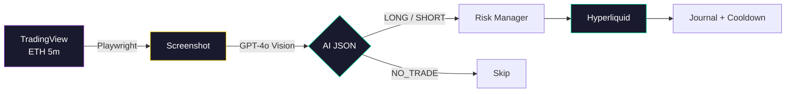

<div align="center">

# ⚡ Arvor

### Hyperliquid ETH Bot · Nested Fractal · AI Vision

**Screenshots your TradingView chart. Reads your fractal signals. Executes on Hyperliquid.**

<br/>

[](https://www.python.org/)
[](https://hyperliquid.xyz/)
[](https://openai.com/)
[](.env.example)
[](https://railway.app/)

<br/>

[Quick Start](#-quick-start) · [How It Works](#-how-it-works) · [Indicator](#-nested-fractal-indicator) · [Railway](#-deploy-on-railway) · [Safety](#-safety-guardrails)

<br/>

```
   TradingView 5m ETH  →  📸 Screenshot  →  🧠 GPT-4o Vision  →  ⚖️ Risk Engine  →  📈 Hyperliquid
```

</div>

---

## ✨ What is Arvor?

**Arvor** is an automated ETH perpetuals trading bot built for [Hyperliquid](https://hyperliquid.xyz). It watches your **Nested Fractal - Clean** indicator on a **5-minute TradingView** chart, uses **AI vision** to extract entry, stop loss, and take profit, then trades with strict risk rules and a full audit journal.

> 🛡️ **Paper trading is the default.** Set `LIVE_TRADING=true` only when you are ready to risk real capital.

<table>
<tr>
<td width="50%">

**🎯 Precision signals**  
Reads gold TP, orange SL, and LONG/SHORT panel directly from your chart — no guesswork on levels.

</td>
<td width="50%">

**🔒 Safety first**  
Loss limits, cooldowns, one position max, invalid JSON blocked, API failures = no trade.

</td>
</tr>
<tr>
<td>

**📓 Full journal**  
Every decision logged with screenshot path, AI response, PnL, and balance.

</td>
<td>

**☁️ Railway ready**  
Dockerfile + Procfile included. Deploy as a worker with persistent volume.

</td>
</tr>
</table>

---

## 🔄 How It Works



| Step | Module | What happens |
|:--:|--------|----------------|
| 1 | `screenshot.py` | Headless Chromium captures your saved chart |
| 2 | `ai_analyzer.py` | Vision model returns structured JSON only |
| 3 | `risk_manager.py` | Position size, daily/weekly/monthly loss caps |
| 4 | `hyperliquid_client.py` | 5x leverage, entry + SL + TP orders |
| 5 | `trade_journal.py` | CSV audit trail + win rate tracking |
| 6 | `cooldown.py` | 30 min pause after every win or loss |

---

## 📐 Nested Fractal Indicator

The bot is tuned for your Pine script **Nested Fractal - Clean**. The AI only trades when it sees an **active signal**:

| On chart | Bot field |
|----------|-----------|
| 🟡 Gold line · `TP:` label | `take_profit` |
| 🟠 Orange line · `SL:` label | `stop_loss` |
| ⬜ White dashed line · panel price | `entry` |
| Panel **LONG** / **SHORT** | `action` |
| Missing TP + SL + panel | `NO_TRADE` |

<details>
<summary><strong>Recommended TradingView setup</strong></summary>

<br/>

1. **ETH** perpetual · **5m** timeframe  
2. Add **Nested Fractal - Clean** to the chart  
3. Save layout → copy URL to `TRADINGVIEW_CHART_URL`  
4. Zoom so **TP:/SL: labels** and the **signal panel** are visible on the right  

| Setting | Value |
|---------|-------|
| Fractal Lookback | `30` |
| Min Fidelity % | `70` |
| Min Confidence % | `65` |
| TP / SL Multiplier | `2.0` / `1.0` |
| Min Bars Between Signals | `50` |

> With 50 bars between signals (~4h on 5m), most cycles correctly return `NO_TRADE` between fractal setups.

</details>

---

## ⚙️ Trading Parameters

<div align="center">

| | |
|:---:|:---|
| **Asset** | ETH only |
| **Timeframe** | 5-minute |
| **Leverage** | 5× |
| **Risk / trade** | 50% of balance to stop |
| **Max positions** | 1 |
| **Daily loss cap** | 10% |
| **Weekly / monthly cap** | 70% |
| **Cooldown** | 30 min after win or loss |

</div>

---

## 🚀 Quick Start

### 1 · Clone

```bash
git clone https://github.com/shep95/arvor-automated-trading-bot.git
cd arvor-automated-trading-bot
```

### 2 · Install

```bash
python -m venv .venv

# Windows
.venv\Scripts\activate

# macOS / Linux
source .venv/bin/activate

pip install -r requirements.txt
playwright install chromium
```

### 3 · Configure

```bash
cp .env.example .env
```

| Variable | Required | Description |
|----------|:--------:|-------------|
| `OPENAI_API_KEY` | ✅ | OpenAI API key |
| `TRADINGVIEW_CHART_URL` | ✅ | Saved ETH 5m chart with Nested Fractal |
| `LIVE_TRADING` | — | `false` (default) · paper mode |
| `PAPER_STARTING_BALANCE` | — | Default `10000` |
| `SCREENSHOT_WAIT_MS` | — | Render wait · default `18000` |
| `HYPERLIQUID_PRIVATE_KEY` | Live | Wallet key |
| `HYPERLIQUID_WALLET_ADDRESS` | Live | Main wallet (not API sub-wallet) |

### 4 · Run

```bash
python main.py
```

```
════════════════════════════════════════════════════════════
  Hyperliquid ETH Bot starting — mode: PAPER
  Paper trading (set LIVE_TRADING=true for live)
════════════════════════════════════════════════════════════
```

Journal → `data/trade_journal.csv` · Screenshots → `data/screenshots/`

### 5 · Go live (when ready)

```env
LIVE_TRADING=true
HYPERLIQUID_PRIVATE_KEY=0x...
HYPERLIQUID_WALLET_ADDRESS=0x...
```

Fund Hyperliquid · authorize API wallet in the [Hyperliquid UI](https://app.hyperliquid.xyz/API) if using an API key.

---

## 🏗️ Project Structure

```
arvor-automated-trading-bot/
│
├── main.py                  # Main loop
├── config.py                # Environment & constants
├── hyperliquid_client.py    # Exchange API + paper simulator
├── screenshot.py            # TradingView capture (Playwright)
├── ai_analyzer.py           # OpenAI vision + JSON validation
├── risk_manager.py          # Sizing, loss limits, win rate
├── trade_executor.py        # Full trade cycle orchestration
├── trade_journal.py         # CSV audit log
├── cooldown.py              # Post-trade 30 min lockout
│
├── Dockerfile               # Railway / Docker (Playwright image)
├── Procfile                 # worker: python main.py
├── requirements.txt
├── .env.example
│
└── data/                    # Runtime (gitignored)
    ├── screenshots/
    ├── trade_journal.csv
    ├── paper_state.json
    ├── risk_state.json
    └── cooldown_state.json
```

---

## ☁️ Deploy on Railway

<table>
<tr>
<td>

**①** Connect [GitHub repo](https://github.com/shep95/arvor-automated-trading-bot)

**②** Use **Dockerfile** deploy (Playwright + Chromium included)

**③** Service type → **Worker** (not web)

</td>
<td>

**④** Add env vars from `.env.example`

**⑤** Mount volume → `/app/data`

**⑥** Start command → `python main.py`

</td>
</tr>
</table>

<details>
<summary><strong>Environment variables on Railway</strong></summary>

<br/>

```env
OPENAI_API_KEY=sk-...
TRADINGVIEW_CHART_URL=https://www.tradingview.com/chart/...
LIVE_TRADING=false
SCREENSHOT_WAIT_MS=22000
PAPER_STARTING_BALANCE=10000
```

Use a **public** TradingView chart URL when possible — login-gated charts often fail headless.

</details>

---

## 🛡️ Safety Guardrails

```
┌─────────────────────────────────────────────────────────┐
│  Invalid JSON          →  NO TRADE                      │
│  NO_TRADE from AI        →  NO TRADE                      │
│  Position already open   →  NO NEW ENTRY                │
│  Daily / weekly / monthly loss hit  →  PAUSE              │
│  Screenshot fails        →  NO TRADE                      │
│  API / order error       →  LOG + STOP (no blind retry)   │
│  Missing SL or TP        →  NO TRADE                      │
└─────────────────────────────────────────────────────────┘
```

---

## 📊 Trade Journal

Every cycle is recorded in `data/trade_journal.csv`:

`timestamp` · `action` · `entry` · `stop_loss` · `take_profit` · `position_size` · `leverage` · `outcome` · `pnl` · `balance_after` · `screenshot_path` · `ai_raw_response` · `mode` · `notes`

---

## 🎛️ Customize

| What | Where |
|------|--------|
| AI prompt & indicator tuning | `ai_analyzer.py` → `AI_PROMPT` |
| Risk %, leverage, cooldown | `config.py` |
| Screenshot timing | `SCREENSHOT_WAIT_MS` in `.env` |
| Vision model | `OPENAI_MODEL=gpt-4o-mini` (cheaper) |

---

## ⚠️ Disclaimer

This software is for **educational purposes**. Perpetual futures with **5× leverage** and **50% risk per trade** can cause rapid total loss. Test extensively in paper mode. You are responsible for your keys, capital, and compliance with applicable laws.

---

<div align="center">

<br/>

**Built for Nested Fractal traders on Hyperliquid**

[⭐ Star this repo](https://github.com/shep95/arvor-automated-trading-bot) · [Report an issue](https://github.com/shep95/arvor-automated-trading-bot/issues)

<br/>

<sub>Arvor · Automated Trading Bot · ETH · AI Vision · Paper First</sub>

</div>
