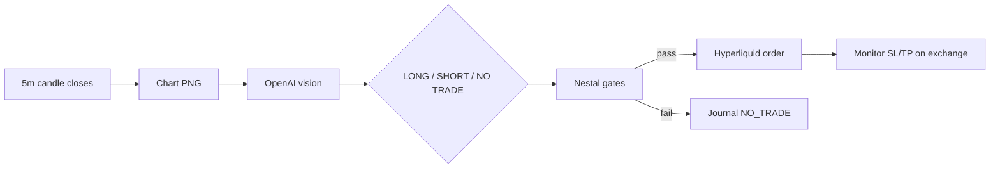

<div align="center">

# Arvor

**Autonomous ETH perps on Hyperliquid — vision in, gates in code, execution out.**

Every **5-minute UTC candle close**, Arvor renders an ETH chart, asks OpenAI *“Would you long or short here?”*, then trades only when deterministic Nestal rules pass. No webhooks. No signal modes. One loop.

<br/>

[](https://www.python.org/)
[](https://hyperliquid.xyz/)
[](https://openai.com/)
[](https://railway.app/)

<br/>

[github.com/ZorakCorp/arvor-automated-trading-bot](https://github.com/ZorakCorp/arvor-automated-trading-bot)

</div>

---

## At a glance

| | |
|---|---|
| **Asset** | ETH perpetuals only |
| **Cadence** | 5m UTC candle close + 3s buffer |
| **Signal** | OpenAI vision (Nestal Fractal prompt) |
| **Gatekeeper** | Code-computed fidelity & confidence — not the model |
| **Default mode** | Live (`LIVE_TRADING=true`) |
| **Risk / reward** | 2:1 TP:SL from pattern size · 15× leverage · 50% balance at risk |

---

## How it works



**While flat:** screenshot → analyze → maybe trade.  
**While in a position:** monitor only — no new screenshots until flat.

The model picks direction and prices. The bot decides whether that pick is allowed.

| Layer | Role |
|-------|------|
| **Vision** | Reads the chart; outputs LONG, SHORT, or NO TRADE + entry / TP / SL |
| **Nestal score** | Computes 5m/15m trends, fractal fidelity (5m), and confidence from Hyperliquid candles |
| **Gates** | Blocks trades that fail hard rules — even if the model is confident |
| **Execution** | Sizes from SL distance, places orders, journals every cycle |

There is no TradingView webhook path and no alternate signal engine.

---

## Nestal Fractal brain

Default instructions: `nestal_prompt.py`. Override entirely with `AI_PROMPT`.

### What the model sees

- **Two panels**: 5m (micro) and 15m (meso) with trend labels and ALIGNED / NOT ALIGNED header
- One question every cycle: *“Would you long or short here?”*
- **Simple question, simple answer** — direction + prices on the **5m** panel, not essays

### What the bot enforces (in code)

| Rule | Threshold | Source |
|------|-----------|--------|
| Trend alignment | 5m + 15m must agree | Always (`nestal_score.py`) |
| LONG | Both **Bullish** (5m: 10 bars, 15m: 5 bars) | Hyperliquid candles |
| SHORT | Both **Bearish** | Hyperliquid candles |
| Fractal fidelity | ≥ 70% | When `NESTAL_GATES=true` |
| Trade confidence | ≥ 65% | When `NESTAL_GATES=true` (never from AI reply) |
| SL / TP | 1× / 2× pattern size → **2:1 R:R** | AI from 5m chart; optional code gates |

Confidence formula: **40% fidelity + 40% if all trends align + 20% base**.  
With `NESTAL_GATES=false`, only multi-timeframe alignment is enforced in Python; fidelity/confidence are AI-judged.

### Example model output

```
LONG

Entry:
3500.50

Take Profit:
3550.50

Stop Loss:
3475.50
```

When structure is weak, the model may say NO TRADE — and the bot may still block LONG/SHORT if gates fail.

---

## Deploy in minutes

Built for [Railway](https://railway.app) via the included **Dockerfile** (Chromium + Playwright for optional TradingView capture).

### 1 · Clone

```bash
git clone https://github.com/ZorakCorp/arvor-automated-trading-bot.git
cd arvor-automated-trading-bot
```

### 2 · Chart source

**Recommended** — no TradingView, no 403 headaches:

```env
CHART_SOURCE=hyperliquid
```

Renders **ETH 5m + 15m** panels from Hyperliquid’s public API (`chart_image.py`).

**Optional** — TradingView screenshot with API fallback:

```env
CHART_SOURCE=auto
CHART_URL=https://www.tradingview.com/chart/YOUR_REAL_ID/
```

`auto` tries `CHART_URL` first, then falls back to Hyperliquid if blocked.

### 3 · Environment

```env
OPENAI_API_KEY=sk-...
CHART_SOURCE=hyperliquid
LIVE_TRADING=true
ARVOR_CONFIRM_LIVE_RISK=true
HYPERLIQUID_PRIVATE_KEY=0x...
HYPERLIQUID_WALLET_ADDRESS=0x...
OPENAI_MODEL=gpt-5.2
SCREENSHOT_WAIT_MS=18000
```

`LIVE_TRADING` defaults to **`true`** when omitted — real orders once wallet keys are set.

### 4 · Ship

Connect the repo on Railway → build with **Dockerfile** → add variables → deploy.

### 5 · Healthy logs

```
Hyperliquid ETH Bot starting — mode: LIVE | signals: AI vision
LIVE TRADING ENABLED — real funds at risk
Chart scan every 5m on UTC candle close → OpenAI (GPT-5.2) → Hyperliquid execution
Cycle 1 — running...
Hyperliquid 5m chart rendered: /app/data/screenshots/eth_chart_....png
OpenAI vision request (model=gpt-5.2)
AI raw signal: SHORT (model=gpt-5.2-2025-12-11) entry=1819.3 tp=1805.5 sl=1826.2
Nestal gate blocked SHORT — fractal fidelity 64% < 70%
Final decision: NO_TRADE (model=gpt-5.2-2025-12-11)
Computed confidence: 85.5%
```

**Most cycles ending in `NO_TRADE` is normal.** Nestal is built for fewer, higher-quality entries — not constant activity.

---

## Configuration

| Variable | Required | Description |
|----------|:--------:|-------------|
| `OPENAI_API_KEY` | ✓ | OpenAI API key |
| `CHART_SOURCE` | | `hyperliquid` (recommended), `auto`, or `url` |
| `CHART_URL` | | Real HTTPS chart link when using `url` / `auto` |
| `HYPERLIQUID_PRIVATE_KEY` | Live | API wallet private key |
| `HYPERLIQUID_WALLET_ADDRESS` | Live | Main `0x` wallet address |
| `ARVOR_CONFIRM_LIVE_RISK` | Live | Must be `true` for live trading |
| `LIVE_TRADING` | | Default `true`; set `false` for paper |
| `OPENAI_MODEL` | | Default `gpt-5.2` |
| `AI_PROMPT` | | Override `nestal_prompt.py` |
| `SCREENSHOT_WAIT_MS` | | Chart load wait (default `18000`) |
| `CHART_STORAGE_STATE_PATH` | | Playwright login state JSON |
| `HYPERLIQUID_TESTNET` | | Default `false` |
| `AUTO_SPOT_TO_PERP` | | Move spot USDC to perps if needed (default `true` live) |
| `LOG_LEVEL` | | Default `INFO` |

Legacy aliases: `TRADINGVIEW_CHART_URL`, `TRADINGVIEW_STORAGE_STATE_PATH`.

Copy `.env.example` for local work:

```bash
cp .env.example .env
```

---

## Risk & execution

Applied after any AI signal passes Nestal gates:

| Setting | Value |
|---------|-------|
| Leverage | 15× |
| Risk per trade | 50% of available balance (sized from SL distance) |
| Cooldown | 30 minutes after a closed trade |
| Loss limits | None — only requires balance > $0 |

---

## Paper mode

Local testing only — no Hyperliquid keys required.

```env
LIVE_TRADING=false
```

Paper balance defaults to **$10,000** (`PAPER_STARTING_BALANCE`).

---

## Project layout

```
├── main.py                 # 5m-aligned scan loop
├── nestal_prompt.py        # Nestal Fractal AI instructions
├── nestal_score.py         # Fidelity, trend, confidence from candles
├── ai_analyzer.py          # OpenAI vision + Nestal gates
├── chart_image.py          # Hyperliquid 5m / 15m chart renderer
├── screenshot.py           # Playwright chart capture (optional URL)
├── trade_executor.py       # Signal → Hyperliquid orders
├── trade_journal.py        # CSV journal per cycle
├── hyperliquid_client.py   # Live + paper exchange client
├── risk_manager.py
├── cooldown.py
├── config.py
├── Dockerfile              # Railway / Playwright
└── tests/
```

---

## Troubleshooting

<details>
<summary><strong>OpenAI / config errors</strong></summary>

| Issue | Fix |
|-------|-----|
| `OPENAI_API_KEY is required` | Add key in Railway or `.env` |
| `CHART_URL is required` | Set a public HTTPS chart URL, or use `CHART_SOURCE=hyperliquid` |
| `HYPERLIQUID_PRIVATE_KEY is required` | Add keys for live mode, or `LIVE_TRADING=false` |
| `ARVOR_CONFIRM_LIVE_RISK` | Set to `true` for live |

</details>

<details>
<summary><strong>Charts & screenshots</strong></summary>

| Issue | Fix |
|-------|-----|
| Screenshot / 403 / login page | `CHART_SOURCE=hyperliquid` — skip TradingView |
| Playwright locally | `pip install -r requirements.txt && playwright install chromium` |

</details>

<details>
<summary><strong>Why so many NO_TRADE cycles?</strong></summary>

| Symptom | Meaning |
|---------|---------|
| `NO_TRADE` every cycle | Expected when fidelity &lt; 70% or trend misaligns |
| Model says SHORT, bot blocks | Gates use candle math; vision can disagree with fidelity |
| Canned AI confidence (58 / 60 / 65) | Ignored — bot uses `nestal_score.py` |
| Computed confidence &lt; 65% | Blocked even if model says LONG / SHORT |

Fractal fidelity compares return patterns across two adjacent 20-bar windows. Choppy markets can sit below 70% for hours while trend still looks bearish or bullish on the chart.

</details>

---

## Local development

```bash
pip install -r requirements.txt
playwright install chromium

cp .env.example .env
# Edit .env — use LIVE_TRADING=false for local tests

python -m unittest tests.test_bot -v
python scripts/smoke_test.py
```

---

## Disclaimer

This software trades **real funds** when `LIVE_TRADING=true`. You are responsible for API keys, position sizing, exchange fees, slippage, and model errors. Use at your own risk.

---

<div align="center">

**[ZorakCorp / arvor-automated-trading-bot](https://github.com/ZorakCorp/arvor-automated-trading-bot)**

</div>
